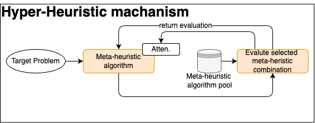

# Hyper-heuristic prototype

// For transformer-base Automated meta-heuristic, please go to ./(discard)ResearchArchitecture

## packages

- python
- matplotlib
- opfunu

## Implementation method

Using a meta-heuristic algorithm to select the best combination of meta-heurstic algorithms (So the hyper algorithm is called the hyper-heuristic algorithm). The implementation method can be toll apart into several keypoint

- target problem form
- hyper-heuristc algorithm
- meta-heuristic algorithm pool
- evaluation metric

1. target problem form
    - We'll be using CEC benchMark (2005~2025) and other benchmark function. But limited to using single objective.
    - INPUT（Pseudo input）：Function label. Including functions, degs and number of terms
    - OUTPUT：A list that shows each optimizer's parameter according to index [[algos_pos, weight, hyper-parameter, etc.], [other optimizer]...]

2. hyper-heuristic algorithm
    - We'll be using DE (Deferential Evolution) algorithm
    - Try out more meta-hueristic algorithm for comparison (If possible)
    - pre-measurement?

3. meta-heuristic algorithm pool
    - **PSO (Particle Swarm Optimization)**
    - **DE (Differential Evolution)**
    - **GWO (Grey Wolf Optimizer)**
    - **HHO (Harris Hawks Optimization)**
    - **GA (Genetic Algorithm)**
    - **SA (Simulated Annealing)**
    - **TS (Tabu Search)**
    - We can control the release time of specific algorithm (which mean it can only be used in specific time)

4. evaluation metric
    - Target function fitness value
    - Convergence speed (time)
    - Convergence stability
    - Convergence rate
    - Explainable decision making(if feasible)
    - Consistency on decision making

## Possible comparison of works

- Changing the release time for each meta-heuristic algorithm
- Try another hyper-heuristic algorithm
- Try out more functions (target function)
- other rule base

## GOALS

1. Get AS MUCH AS POSSIBLE labled function from this hyper-heuristic algorithm's result in order to build a automated meta-heuristic transformer(Long-term goals)

2. Get the best combination of meta-heuristic algorithm

3. Explore the impact of self-attention machanisms on the quality of decision-making

## Ideas (Write down your ideas here)

- With/Without attention
- random hyper-param for hyper-heuristic

## Questions
